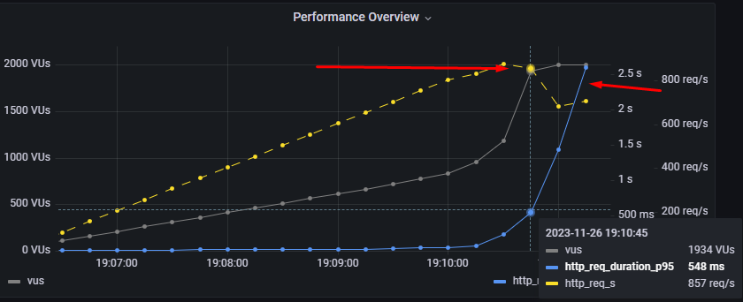

# MTS sre-course homework leshapop@gmail.com (Student71)

Нагрузочное тестирование WEB API - weather.student71.local


Install testing tool

- First you need to install k6
   - [k6](https://k6.io/docs/get-started/installation/)
   - Edit `run-test.sh` if you need use prometheus + grafana k6 dashboard.
   - Edit `profiles.js`
   - THEN RUN:
  ```
  ./run-test <select-test-profile.js>
  ```

# Вводные данные
Headers:
`'Host: weather.student71.local'`
`'accept: text/plain'`
`'Content-Type: application/json'`

Endpoints - GET:
`WeatherForecast/`
`Cities/`
`Forecast/`

# Требования SLA/SLO
`SLA:`
- Request duration **P95 <= 600ms**
- Error **rate < 2%**
- Max Load **time 8m**

`SLO:`
- Request duration **P95 <= 500ms**
- Error **rate <= 1%**
- Max Load time **10m**

# API Сервис погоды
Примем за основу, что для пользователей использующих наш сервис будет достаточно только получать данные о погоде, доступ к INSERT/UPDATE методам будет открыт только операторам и автоматическим сервисам предоставления данных о погоде. 
Из этого следует, что для дальнейших тестов нам потребуется найти максимальную нагрузку в 100% GET запросов при условии POST в <=50RPS. 
Это не касается Breakpoint профиля.

# Инструменты:
`K6 Grafana`

# Профили нагрузки:

- #### Breakpoint test (web-api-test-breakpoint.js) 1:1 (GET/POST)
  * Описание: Постепенное увеличение нагрузки до критической.
  * Цели: Поиск максимума нагрузки RPS, поиск узкого места, происк точки отказа.
  * Методы: GET (WeatherForecast) от 0 до 100%
  * Методы: POST Cities 50 RPS

- #### Stress test (web-api-test-stress.js) 9:1 (GET/POST)
  * Описание: Постепенное увеличение нагрузки до 90% от максимума. Поддержание нагрузки 1 x Max Load time.
  * Цели: Проверка выполнения SLO за расчетное время под нагрузкой 90% от максимума 1 x Max Load time.
  * Методы: GET (WeatherForecast) 90% от MAXRPS
  * Методы: POST Cities 50 RPS

- #### API Endpoints test (web-api-test-stress-all.js)
  * Описание: Постепенное увеличение небольшой нагрузки на все эндпоинты API. Поддержание нагрузки 1 x Max Load time.
  * Цели: Проверка работы всех эндпоинтов API на ошибки при соблюдении SLA/SLO. 
  * Методы: GET/POST (ALL)

- #### Daily Test (web-api-test-daily.js) 5:0.5 (GET/POST)
  * Описание: Поддержание нагрузки 50% от максимума 2 x Max Load time. 80% кратковременные пиковые нагрузки в течении 1m
  * Цели: Проверка выполнения SLO под стандартной дневной нагрузкой определенной в 50% от максимума за 2 x Max Load time.
  * Методы: GET (WeatherForecast) 50% от MAXRPS
  * Методы: POST Cities 25 RPS

# Отчет о тестировании:

# Breakpoint test:
* #### Метод GET
  - При НТ GET запросами >=850 req/s возникает деградация сервиса, загрузка ПОДов 100%, Request duration P95 > 3s. 
  - Достигнуто узкое место в системе(PODS CPU).
  - `http_req_duration: max=6.48s p(90)=3.83s  p(95)=4.24s`
  - После падения нагрузки, сервис приходит в норму.

* #### Графики GET
  
  

  

* #### Метод POST
  - При НТ POST запросами >=480 req/s возникает деградация сервиса, загрузка DB 100% CPU, загрузка ПОДов ~65%, Request duration P95 > 6s. 
  - Достигнуто узкое место в системе (DB CPU).
  - `http_req_duration: max=18.47s p(90)=5.48s p(95)=6.96s`
  - После падения нагрузки, сервис приходит в норму.

* #### Графики POST

  

   

# Вывод по breakpoint тестам
  После изучения кода приложения и сравнения RPS при тестировании GET эндпоинтов WeatherForecast/ и Cities/, была найдена проблема в не оптимизированном коде метода WeatherForecast.
  Метод WeatherForecast получает все данные по всем городам и погоде из базы, что избыточно. 
  Так же он использует большое количество SELECT запросов в цикле, вместо выборки с JOIN по ID города. Данные об этом переданы разработчику.

# Расчет максимальной производительности системы
  - Максимальная производительность системы при GET запросах на чтение в 850 RPS - 5% погрешность = 810 RPS, при условии соблюдении требования SLO. Берем за основу 100%, т.к. это самое узкое место в системе (POD CPU)
  - Максимальную производительность системы при POST запросах на запись в 480 RPS - 5% погрешность = 460 RPS, при условии соблюдении требования SLO.
  - Расчитаем 90% RPS нагрузки: 810 RPS * 0.9 = 729 RPS
  - Раcчитаем общий профиль нагрузки в 90% GET/POST: 729RPS_GET - (460RPS_POST * 0.1 = 46) =~ 683RPS_GET + 46RPS_POST

# API Endpoints test
  - Создаем или выделяем несколько записей из базы (andomItem) для теста.
  - Запрашиваем каждую точку API по GET.
  - Меняем данные PUT.
  - Повторно запрашиваем измененные данные GET.
  - Меняем данные обратно на исходные PUT.
  - Все время запрашиваем рабочую точку WeatherForecast.
  ````
     ✓ WeatherForecast_res status is 200
     ✓ C_res status is 200
     ✓ C_res_get_cityid status is 200
     ✓ C_put status is 200
     ✓ C_put_back status is 200
     ✓ FC_res status is 200
     ✓ FC_res_get_forecastid status is 200
     ✓ FC_PUT status is 200
     ✓ FC_put_back status is 200
  ````
  - Тест пройден. Время ответа не выходит за рамки SLO. Ошибок нет.

# Stress test:

  - 90% GET метод течении Max Load time 10m ~ `683RPS`
  - 10% POST метод течении Max Load time 10m ~ `46RPS`
  - При условии 9:1 (GET/POST) ~683RPS_GET / ~46RPS_POST наблюдается стабильная работа системы. POD CPU load ~95%, DB CPU load ~50%.
  - `http_req_duration: max=3.71s p(90)=44.87ms p(95)=61.21ms`
  - Время ответа не выходит за рамки SLO. Ошибок нет.

  * #### Графики STRESS test

  

  

# Daily Test:

 - 45% от 810 RPS = 365 RPS в течении Max Load time 20m. Имитирует запросы пользователей.
 - 5% POST 25 RPS Постоянная нагрузка. Имитирует работу сервиса по добавлению прогнозов погоды.
 - 80% кратковременные пиковые нагрузки в течении 1m = 650
 - При условии 5:0.5 (GET/POST) ~340RPS_GET / ~23RPS_POST наблюдается стабильная работа системы. POD CPU load ~70%-80%, DB CPU load ~30%, DB iops ~10% utilization.
 - `http_req_duration: max=3.49s   p(90)=34.73ms  p(95)=56.02ms`
 - Время ответа не выходит за рамки SLO. Ошибок нет.

 * #### Графики Daily test


