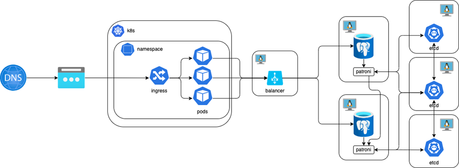

# MTS sre-course homework leshapop@gmail.com (Student71)

Нагрузочное тестирование WEB API - weather.student71.local



Install testing tool

- First you need to install k6
   - [k6](https://k6.io/docs/get-started/installation/)
   - Edit `run-test.sh` if you need use prometheus + grafana k6 dashboard.
   - Edit `profiles.js`
   - THEN RUN:
  ```
  ./run-test <select-test-profile.js>

  ```

# Отчет о НТ

1. Вводные данные
Headers:
-H 'Host: weather.student71.local'
-H 'accept: text/plain'
-H 'Content-Type: application/json'

Endpoints - GET:
WeatherForecast/
Cities/1
Forecast/1

Endpoints - POST:
Cities/
  "id": 0,
  "name": "text"
  
Forecast/${Cities_id}
  "id": 0,
  "cityId": "0",
  "dateTime": 0,
  "temperature": "0",
  "summary": "text"

2. Требования SLA/SLO

SLA: 
1. Request duration P95 <= 600ms
2. Error rate < 2%
3. Max Load time 8m

SLO:
1. Request duration P95 <= 500ms
2. Error rate <= 1%
3. Max Load time 10m

API Сервис погоды
Примем за основу, что для пользователей использующих наш сервис будет достаточно только получать данные о погоде, доступ к INSERT/UPDATE методам будет открыт только операторам и автоматическим сервисам предоставления данных о погоде. Из этого следует, что для дальнейших тестов нам потребуется обеспечить нагрузку в 90% GET запросов и 10% POST (<=50RPS). Это не касается Breakpoint тестов.

3. Инструменты:
K6 Grafana

4. Профили нагрузки:

1. Breakpoint test (web-api-test-breakpoint.js) 1:1 (GET/POST)
Описание: Постепенное увеличение нагрузки до критической.
Цели: Поиск максимума нагрузки RPS, поиск узкого места, происк точки отказа.
Методы: GET (WeatherForecast)
Методы: POST Cities

3. Stress test (web-api-test-stress.js) 9:1 (GET/POST)
Описание: Постепенное увеличение нагрузки до 90% от максимума. Поддержание нагрузки 1 x Max Load time.
Цели: Проверка выполнения SLO за расчетное время под нагрузкой 90% от максимума 1 x Max Load time.
Методы: GET (ALL) 90%
Методы: POST Cities 10%

5. Daily Test (web-api-test-daily.js) 9:1 (GET/POST)
Описание: Поддержание нагрузки 50% от максимума 2 x Max Load time.
Цели: Проверка выполнения SLO под стандартной дневной нагрузкой определенной в 50% от максимума за 2 x Max Load time.
Методы: GET (ALL) 45%
Методы: POST Cities 5%

6. Отчет о тестировании:

`Breakpoint test:`
При НТ GET запросами >850 req/s возникает деградация сервиса, загрузка ПОДов 100%, Request duration P95 > 3s. Достигнуто узкое место в системе.
✗ http_req_duration: max=6.48s    p(90)=3.83s    p(95)=4.24s
После падения нагрузки, сервис приходит в норму.

При НТ POST запросами >480 req/s возникает деградация сервиса, загрузка DB 100% CPU, загрузка ПОДов ~65%, Request duration P95 > 6s. Достигнуто узкое место в системе.
✗ http_req_duration: max=18.47s  p(90)=5.48s   p(95)=6.96s
После падения нагрузки, сервис приходит в норму.

Следовательно для следующих тестов определим:
Максимальную производительность системы при GET запросах на чтение в 850 RPS, при условии соблюдении требования SLO. Берем за основу 100%, т.к. это самое узкое место в системе (POD CPU)
Максимальную производительность системы при POST запросах на запись в 480 RPS, при условии соблюдении требования SLO.
Расчитаем 90% RPS нагрузки: 850 RPS * 0.9 = 765 RPS
Раcчитаем общий профиль нагрузки в 90% GET/POST: 765RPS_GET - (480RPS_POST * 0.1 = 48) =~ 717RPS_GET + 48RPS_POST

`Stress test:`
90% GET метод течении Max Load time 10m ~ 717RPS
10% POST метод течении Max Load time 10m ~ 48RPS

При условии 90:10 (GET/POST) ~717RPS_GET / ~48RPS_POST наблюдается стабильная работа системы. POD CPU load ~70%, DB CPU load ~40%, DB iops ~90% utilization.
http_req_duration: avg=19.06ms min=2.2ms  med=5.08ms  max=4s p(90)=8.35ms   p(95)=9.37ms
Время ответа не выходит за рамки SLO. Ошибок нет.

`Daily Test:`
50% от 600 RPS = 300 RPS в течении Max Load time 12m
При условии 1:1 (GET/POST) ~150 RPS/ ~150 RPS наблюдается стабильная работа системы. POD CPU load ~50%, DB CPU load ~30%, DB iops ~55% utilization.
Время ответа не выходит за рамки SLO. Ошибок нет.
