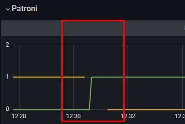
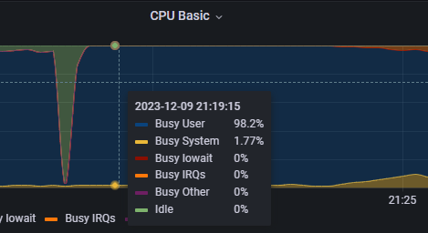

# MTS sre-course homework leshapop@gmail.com (Student71)

``` Chaos engineering WEB API - weather.student71.local ```


## Эксперимент №1 "Отключение узла"
1. **Описание эксперимента:**
-  Подадим дневной профиль нагрузки (daily) k6 на приложение. Физический отключим DB master узел postgres/patroni в консоли MTSCloud.
2. **Ожидаемые результаты:**
-  Переключение на нового лидера за ~25 сек и менее, восстановлена работоспособность в течении 1 мин.
3. **Реальные результаты:** 

-  Влияние на систему по мониторингу - за 1 мин полное восстановление RPS и ошибок.
-  Сработал алертинг на падение ноды patroni/postgres.


   
   
   


 -  Произошло падение RPS, errors 500, 502, 503, выросло latency P99. P95 осталось в пределах SLO.

    
 
-  Выборы нового лидера patroni и переключение под нагрузкой произошло ~25 сек.

    

    

4. **Анализ результатов:**
-  Тест пройден, переключение произошло в ожидаемое время, влияние на систему в пределах ожидаемого.
-  Patroni постоянно проверяет статус мастера или обновляет ключ мастера в etcd. После потери связи с master узлом ключ пропадает и происходят перевыборы мастера. Живая реплика отправляет запрос в etcd и получает статус лидера. Если связи с etcd нет, лидер не может быть выбран.

    

## Эксперимент №2 "Имитация частичной потери сети"
1. Описание эксперимента:
-  Имитируем временные проблемы с сетью между узлами кластера patroni/poetgres. Потери пакетов 30% 50% 75%.

````
blade create network loss --interface ens160 --percent 30 --timeout 60 --exclude-port 22 --destination-ip 10.0.33.4
blade create network loss --interface ens160 --percent 50 --timeout 60 --exclude-port 22 --destination-ip 10.0.33.4
blade create network loss --interface ens160 --percent 75 --timeout 60 --exclude-port 22 --destination-ip 10.0.33.4
````

-  Смотрим лаг репликации

````
psql -U postgres
SELECT pid,application_name,client_addr,client_hostname,state,sync_state,replay_lag FROM pg_stat_replication;
````

2. **Ожидаемые результаты:** 
-  Проверить реальный лаг репликации при сетевых проблемах между узлами.
-  Узнать при каких частичных потерях в сети кластер может быть работоспособен.
3. **Реальные результаты:**

- При потерях 30% лаг репликации не обнаруживается. Система работает стабильно.
- При потерях 50% наблюдаем стабильный лаг в 10 сек.    
   
 
- При потерях 75% и более наблюдаем сильный лаг в ~45+ сек. и его рост.
   

4. **Анализ результатов:**
-  Исходя из результатов стабильную работу кластера можно гарантировать при потерях в сети сежду узлами не более 50% 

## Эксперимент №3 "Высокая нагрузка на CPU или I/O"
1. **Описание эксперимента:** 
-  Подадим дневной профиль нагрузки (daily) k6 на приложение. 
-  С помощью chaosblade нагрузим DB master узел postgres/patroni CPU на 95%.
  -  И дисковую систему с базой данных.

     ````
     blade create cpu fullload --cpu-percent 70 --timeout 300
     blade create cpu fullload --cpu-percent 80 --timeout 300
     blade create cpu fullload --cpu-percent 95 --timeout 300
     blade create cpu fullload --cpu-percent 100 --timeout 300
     blade create disk burn --read --write --path /mnt/db/1 --timeout 300
     ````
2. **Ожидаемые результаты:** 
-  При CPU load < 90% Небольшое увеличение latency. Система должна отработать без ошибок.
-  При CPU load > 90% Существенное увеличение latency. Система должна отработать без ошибок.
3. **Реальные результаты:** 
-  При CPU load > 95% Ошибок не наблюдается. Повышение latency. Выход latency P95 за пределы SLO (>400ms)

    

    
 
    

    

4. **Анализ результатов:** 
-  При дневном профиле нагрузки система справляется с кратковременным ростом утилизации CPU < 95% и I/O.
-  Небольшой выход latency P95 за пределы SLO (>400ms)
-  При CPU 100% cистема работает с высокими задержками, что ожидаемо. Лидер не сменился, задержек репликации нет.
-  При постоянной нагрузке около максимума должны сработать алерты. Это мы проверим в следующем эксперименте.


## Эксперимент №4 "Тестирование систем мониторинга и оповещения"
1. **Описание эксперимента:**
-  Заполним диск на master ноде до 95%.
-  Загрузим CPU на master ноде до 100%.
-  Заполним RAM на master ноде до 90%.
   ````
   df -h /home/1
   blade create disk fill --path /home/1 --size 8500
   blade c mem load --mode ram --mem-percent 90 --timeout 600
   blade create cpu fullload --cpu-percent 100 --timeout 600
   ````
2. **Ожидаемые результаты:** 
-  Срабатывание алертов согласно настройкам в prometheus.
3. **Реальные результаты:** 
-  Некоторые алерты имели погрешности в порогах срабатывания и требовали донастройки.

    

    

    

    
 
    

    

4. **Анализ результатов:** 
-  Благодаря экспериметам удалось выявить недочеты в конфигурации алертов. Не всегда ожидание совпадало с реальным порогом срабатывания.
-  Исправлены некоторые пороги срабатывания алертов.

## Эксперимент №5 "Split-brain"
1. **Описание эксперимента:**
-  Попробуем с помощью утилиты chaosblade изолировать узлы patroni/postgres и спровоцируем выборы нового лидера в замкнутой среде.
-  Попытаемся вызвать эффект plit-brain когда каждая нода объявит себя лидером.
-  Запускаем на мастере и реплике одновременно:
   ````
   blade create network loss --percent 100 --destination-ip 10.0.33.3,10.0.33.5,10.0.33.6,10.0.33.7 --interface ens160 --exclude-port 22 --timeout 600
   ````
   ````
   blade create network loss --percent 100 --destination-ip 10.0.33.4,10.0.33.5,10.0.33.6,10.0.33.7 --interface ens160 --exclude-port 22 --timeout 600
   ````
2. **Ожидаемые результаты:** 
-  Изучить поведение patroni в рамках изоляции от узлов etcd и от master/slave узла.
-  Вызов split-brain на обоих узлах patroni/postgres. 
3. **Реальные результаты:**
-  Начальное положение дел в кластере:

    

-  Лидер не был выбран т.к. отсутсвует связь с кластером etcd.

    

-  Приложение перестало работать. Наблюдаются ошибки и полное отсутствие связи с базой данных. 

    

-  Обе ноды patroni/postgres перешли в статус Replica т.к. patroni не смог установить связь с кластером etcd.  

   
 
    

-  Сработали алерты на latency, http errors, доступность blackbox и patroni has no leader alert. 

   

-  После появления связи все пришло в норму. Объявлен лидер кластера и реплика с лагом. Работоспособность приложения восстановлена.

   

4. **Анализ результатов:** 
-  Не получилось вызвать split-brain на нодах, patroni при потере связи с etcd перевел каждую ноду postgres в статус replica. 
-  При исходных данных и полной изоляции ноды patroni split-brain невозможен.
## Эксперимент №6 "Долгосрочная изоляция"
1. **Описание эксперимента:**
-  Отключим связь реплики на 20 минут

   ````
   blade create network loss --percent 100 --destination-ip 10.0.33.3,10.0.33.5,10.0.33.6,10.0.33.7 --interface ens160 --exclude-port 22 --timeout 1200
   ````
  
-  Смотрим репликацию:

   ````
   select * from pg_stat_wal_receiver;
   ````
  
2. **Ожидаемые результаты:** 
-  Продолжение репликации после восстановления связи с мастером.
3. **Реальные результаты:** 

4. **Анализ результатов:** 

## Эксперимент №7 "Сбои сервисов зависимостей"
1. **Описание эксперимента:**
2. **Ожидаемые результаты:** 
3. **Реальные результаты:** 
4. **Анализ результатов:** 
