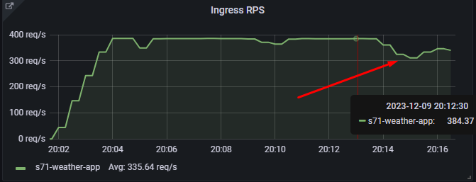

# MTS sre-course homework leshapop@gmail.com (Student71)

``` Chaos engineering WEB API - weather.student71.local ```


## Эксперимент №1 "Отключение узла"
1. **Описание эксперимента:**
-  Подадим дневной профиль нагрузки (daily) k6 на приложение. Физический отключим DB master узел postgres/patroni в консоли MTSCloud.
2. **Ожидаемые результаты:**
-  Переключение на нового лидера за 1 мин и менее, полная работоспособность в течении 2 мин.
3. **Реальные результаты:** 
-  Выборы нового лидера patroni и переключение под нагрузкой произошло за 30 сек.
-  Произошло падение RPS, errors 500, 502, 503.
-  Влияние на систему по мониторингу - за 1 мин. 45 сек. полное восстановление RPS и ошибок.
-  Сработал алертинг на падение ноды patroni/postgres.

    

    
 
     

    

4. **Анализ результатов:**
-  Тест пройден, переключение произошло в ожидаемое время, влияние на систему в пределах ожидаемого.
## Эксперимент №2 "Имитация частичной потери сети"
1. Описание эксперимента:
2. Ожидаемые результаты: 
3. Реальные результаты: 
4. Анализ результатов: 

## Эксперимент №3 "Высокая нагрузка на CPU или I/O"
1. Описание эксперимента: 
-  Подадим дневной профиль нагрузки (daily) k6 на приложение. 
-  С помощью chaosblade нагрузим DB master узел postgres/patroni CPU а 90%.
-  И дисковую систему с базой данных.
````
    blade create cpu fullload --cpu-percent 95 --timeout 300
    blade create disk burn --read --write --path /mnt/db/1 --timeout 300
````
2. Ожидаемые результаты: 
-  Небольшое увеличение latency. Система должна отработать без ошибок.
3. Реальные результаты: 
-  Ошибок не наблюдается. Повышение latency. Выход latency а пределы SLO (400ms)

    

    
 
    

    

4. Анализ результатов: 


## Эксперимент №4 "Тестирование систем мониторинга и оповещения"
1. Описание эксперимента:
-  Заполним диск на master ноде до 95%.
-  Загрузим CPU на master ноде до 97%.
-  Заполним RAM на master ноде до 85%.
````
df -h /home/1
blade create disk fill --path /home/1 --size 8500
blade c mem load --mode ram --mem-percent 85 --timeout 900
blade create cpu fullload --cpu-percent 97 --timeout 300
````
2. Ожидаемые результаты: 
-  Срабатывание алертов согласно настройкам в prometheus.
3. Реальные результаты: 
-  Некоторые алерты имели погрешности в порогах срабатывания и требовали донастройки.

    

    

    

    
 
    

    

4. Анализ результатов: 
-  Благодаря экспериметам удалось выявить недочеты в конфигурации алертов. Не всегда ожидание совпадало с реальным порогом срабатывания.
-  Исправлены некоторые пороги срабатывания алертов.

## Эксперимент №5 "Split-brain"
1. **Описание эксперимента:**
-  Запускаем на мастере и реплике одновременно:
````
blade create network loss --percent 100 --destination-ip 10.0.33.3,10.0.33.5,10.0.33.6,10.0.33.7 --interface ens160 --exclude-port 22 --timeout 600
````
````
blade create network loss --percent 100 --destination-ip 10.0.33.4,10.0.33.5,10.0.33.6,10.0.33.7 --interface ens160 --exclude-port 22 --timeout 600
````
2. **Ожидаемые результаты:** 
3. **Реальные результаты:**
-  Начальное положение дел в кластере:

    

-  Лидер не был выбран т.к. отсутсвует связь с кластером etcd.

    

-  Приложение перестало работать. Наблюдаются ошибки и полное отсутствие связи с базой данных. 

    

-  Обе ноды patroni/postgres перешли в статус Replica. 

   
 
    

-  Сработали алерты на latency, http errors, доступность blackbox и patroni has no leader alert. 

   

-  После появления связи все пришло в норму. Объявлен лидер кластера и реплика с лагом. Работоспособность приложения восстановлена.

   

4. **Анализ результатов:** 

## Эксперимент №6 "Долгосрочная изоляция"
1. Описание эксперимента:
2. Ожидаемые результаты: 
3. Реальные результаты: 
4. Анализ результатов: 

## Эксперимент №7 "Сбои сервисов зависимостей"
1. Описание эксперимента:
2. Ожидаемые результаты: 
3. Реальные результаты: 
4. Анализ результатов: 
