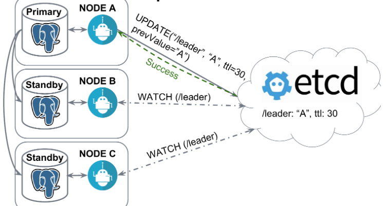
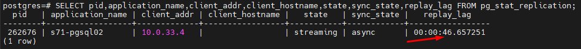

# MTS sre-course homework leshapop@gmail.com (Student71)

``` Chaos engineering WEB API - weather.student71.local ```


## Инструменты
```ChaosBlade```

-  Установка:
````
wget https://github.com/chaosblade-io/chaosblade/releases/download/v1.7.2/chaosblade-1.7.2-linux-amd64.tar.gz

tar -xvf chaosblade-1.7.2-linux-amd64.tar.gz && cd chaosblade-1.7.2/
````

## Эксперимент №1 "Отключение узла"
1. **Описание эксперимента:**
-  Подадим дневной профиль нагрузки (daily) k6 на приложение. Физически отключим DB master узел postgres/patroni в консоли MTSCloud.
2. **Ожидаемые результаты:**
-  Переключение на нового лидера за ~25 сек и менее, восстановлена работоспособность в течении 1 мин.
3. **Реальные результаты:** 

-  Влияние на систему по мониторингу - за 1 мин полное восстановление RPS и ошибок.
-  Сработал алертинг на падение ноды patroni/postgres.


   
   
   


 -  Произошло падение RPS, errors 500, 502, 503, выросло latency P99. P95 осталось в пределах SLO.

    
 
-  Выборы нового лидера patroni и переключение под нагрузкой произошло ~25 сек.

    

    

4. **Анализ результатов:**
-  Тест пройден, переключение произошло в ожидаемое время, влияние на систему в пределах ожидаемого.
-  Patroni постоянно проверяет статус мастера или обновляет ключ мастера в etcd. После потери связи с master узлом ключ пропадает и происходят перевыборы мастера. Живая реплика отправляет запрос в etcd и получает статус лидера. Если связи с etcd нет, лидер не может быть выбран.

    

## Эксперимент №2 "Имитация частичной потери сети"
1. Описание эксперимента:
-  Имитируем временные проблемы с сетью между узлами кластера patroni/poetgres. Потери пакетов 30% 50% 75%.

````
blade create network loss --interface ens160 --percent 30 --timeout 60 --exclude-port 22 --destination-ip 10.0.33.4
blade create network loss --interface ens160 --percent 50 --timeout 60 --exclude-port 22 --destination-ip 10.0.33.4
blade create network loss --interface ens160 --percent 75 --timeout 60 --exclude-port 22 --destination-ip 10.0.33.4
````

-  Смотрим лаг репликации

````
psql -U postgres
SELECT pid,application_name,client_addr,client_hostname,state,sync_state,replay_lag FROM pg_stat_replication;
````

2. **Ожидаемые результаты:** 
-  Проверить реальный лаг репликации при сетевых проблемах между узлами.
-  Узнать при каких частичных потерях в сети кластер может быть работоспособен.
3. **Реальные результаты:**

- При потерях 30% лаг репликации не обнаруживается. Система работает стабильно.
- При потерях 50% наблюдаем стабильный лаг в 10 сек.    
   
 
- При потерях 75% и более наблюдаем сильный лаг в ~45+ сек. и его рост.
   

4. **Анализ результатов:**
-  Исходя из результатов стабильную работу кластера можно гарантировать при потерях в сети сежду узлами не более 50% 

## Эксперимент №3 "Высокая нагрузка на CPU или I/O"
1. **Описание эксперимента:** 
-  Подадим дневной профиль нагрузки (daily) k6 на приложение. 
-  С помощью chaosblade нагрузим DB master узел postgres/patroni CPU на 95%.
  -  И дисковую систему с базой данных.

     ````
     blade create cpu fullload --cpu-percent 70 --timeout 300
     blade create cpu fullload --cpu-percent 80 --timeout 300
     blade create cpu fullload --cpu-percent 95 --timeout 300
     blade create cpu fullload --cpu-percent 100 --timeout 300
     blade create disk burn --read --write --path /mnt/db/1 --timeout 300
     ````
2. **Ожидаемые результаты:** 
-  При CPU load < 90% Небольшое увеличение latency. Система должна отработать без ошибок.
-  При CPU load > 90% Существенное увеличение latency. Система должна отработать без ошибок.
3. **Реальные результаты:** 
-  При CPU load > 95% Ошибок не наблюдается. Повышение latency. Выход latency P95 за пределы SLO (>400ms)

    

    
 
    

    

4. **Анализ результатов:** 
-  При дневном профиле нагрузки система справляется с кратковременным ростом утилизации CPU < 95% и I/O.
-  Небольшой выход latency P95 за пределы SLO (>400ms)
-  При CPU 100% cистема работает с высокими задержками, что ожидаемо. Лидер не сменился, задержек репликации нет.
-  При постоянной нагрузке около максимума должны сработать алерты. Это мы проверим в следующем эксперименте.


## Эксперимент №4 "Тестирование систем мониторинга и оповещения"
1. **Описание эксперимента:**
-  Заполним диск на master ноде до 95%.
-  Загрузим CPU на master ноде до 100%.
-  Заполним RAM на master ноде до 90%.
   ````
   df -h /home/1
   blade create disk fill --path /home/1 --size 8500
   blade c mem load --mode ram --mem-percent 90 --timeout 600
   blade create cpu fullload --cpu-percent 100 --timeout 600
   ````
2. **Ожидаемые результаты:** 
-  Срабатывание алертов согласно настройкам в prometheus.
3. **Реальные результаты:** 
-  Некоторые алерты имели погрешности в порогах срабатывания и требовали настройки.

    

    

    

    
 
    

    

4. **Анализ результатов:** 
-  Благодаря экспериметам удалось выявить недочеты в конфигурации алертов. Не всегда ожидание совпадало с реальным порогом срабатывания.
-  Исправлены некоторые пороги срабатывания алертов, спасибо хаосу за это! :)

## Эксперимент №5 "Split-brain"
1. **Описание эксперимента:**
-  Попробуем с помощью утилиты chaosblade изолировать узлы patroni/postgres и спровоцируем выборы нового лидера в замкнутой среде.
-  Попытаемся вызвать эффект split-brain когда каждая нода объявит себя лидером.
-  Запускаем на мастере и реплике одновременно:
   ````
   blade create network loss --percent 100 --destination-ip 10.0.33.3,10.0.33.5,10.0.33.6,10.0.33.7 --interface ens160 --exclude-port 22 --timeout 600
   ````
   ````
   blade create network loss --percent 100 --destination-ip 10.0.33.4,10.0.33.5,10.0.33.6,10.0.33.7 --interface ens160 --exclude-port 22 --timeout 600
   ````
2. **Ожидаемые результаты:** 
-  Изучить поведение patroni в рамках изоляции от узлов etcd и от master/slave узла.
-  Объявление лидеров на обоих узлах patroni/postgres. 
3. **Реальные результаты:**
-  Начальное положение дел в кластере:

    

-  Лидер не был выбран т.к. отсутсвует связь с кластером etcd.

    

-  Приложение перестало работать. Наблюдаются ошибки и полное отсутствие связи с базой данных. 

    

-  Обе ноды patroni/postgres перешли в статус Replica т.к. patroni не смог установить связь с кластером etcd.  

   
 
    

-  Сработали алерты на latency, http errors, доступность blackbox и patroni has no leader alert. 

   

-  После появления связи все пришло в норму. Объявлен лидер кластера и реплика с лагом. Работоспособность приложения восстановлена.

   

4. **Анализ результатов:** 
-  Не получилось вызвать split-brain на нодах, patroni при потере связи с etcd перевел каждую ноду postgres в статус replica. 
-  При исходных данных и полной изоляции ноды patroni split-brain невозможен.

## Эксперимент №6 "Долгосрочная изоляция"
1. **Описание эксперимента:**
-  Отключим связь реплики на 20 минут

   ````
   blade create network loss --percent 100 --destination-ip 10.0.33.3,10.0.33.5,10.0.33.6,10.0.33.7 --interface ens160 --exclude-port 22 --timeout 1200
   ````
-  Смотрим репликацию на мастере и реплике.
  
2. **Ожидаемые результаты:** 
-  Нода остается в статусе реплики.
-  Продолжение репликации после восстановления связи с мастером.
3. **Реальные результаты:**  
-  Смотрим репликацию на мастере:
````
postgres=# SELECT pid,application_name,client_addr,client_hostname,state,sync_state,replay_lag FROM pg_stat_replication;
 pid | application_name | client_addr | client_hostname | state | sync_state | replay_lag
-----+------------------+-------------+-----------------+-------+------------+------------
(0 rows)
````
-  Смотрим репликацию на реплике:
````
    pid | status | receive_start_lsn | receive_start_tli | written_lsn | flushed_lsn | received_tli | last_msg_send_time | last_msg_receipt_time | latest_end_lsn | latest_end_time | slot_name | sender_host | sender_port | conninfo
-----+--------+-------------------+-------------------+-------------+-------------+--------------+--------------------+-----------------------+----------------+-----------------+-----------+-------------+-------------+----------
(0 rows)
````
-  После восстановления связи:
````
   postgres=# SELECT pid,application_name,client_addr,client_hostname,state,sync_state,replay_lag FROM pg_stat_replication;
  pid   | application_name | client_addr | client_hostname |   state   | sync_state | replay_lag
--------+------------------+-------------+-----------------+-----------+------------+------------
 288938 | s71-pgsql02      | 10.0.33.4   |                 | streaming | async      |
(1 row)

  pid  |  status   | receive_start_lsn | receive_start_tli | written_lsn | flushed_lsn | received_tli |      last_msg_send_time       |     last_msg_receipt_time     | latest_end_lsn |        latest_end_time        |  slot_name  | sender_host | sender_port |                                                                                                                                                                                                    conninfo                                                                                                                                                            
-------+-----------+-------------------+-------------------+-------------+-------------+--------------+-------------------------------+-------------------------------+----------------+-------------------------------+-------------+-------------+-------------+----------------------------------------------------------------------------------------------------------------------------------------------------------------------------------------------------------------------------------------------------------------------------------------------------------------------------------------------------------------------------------------------------------------
 23140 | streaming | 0/3D000000        |                12 |             | 0/3D000000  |           12 | 2023-12-10 16:33:20.589179+03 | 2023-12-10 16:33:20.589146+03 | 0/3D000000     | 2023-12-10 16:30:49.180551+03 | s71_pgsql02 | 10.0.33.3   |        5432 | user=replicator passfile=/var/lib/postgresql/.pgpass_patroni channel_binding=prefer dbname=replication host=10.0.33.3 port=5432 application_name=s71-pgsql02 fallback_application_name=s71_pgsql_cluster sslmode=prefer sslcompression=0 sslcertmode=allow sslsni=1 ssl_min_protocol_version=TLSv1.2 gssencmode=prefer krbsrvname=postgres gssdelegation=0 target_session_attrs=any load_balance_hosts=disable
(1 row)

Dec 10 16:30:48 s71-pgsql02 patroni[847]: 2023-12-10 16:30:48,403 ERROR: Exceeded retry deadline
Dec 10 16:30:48 s71-pgsql02 patroni[847]: 2023-12-10 16:30:48,404 ERROR: Error communicating with DCS
Dec 10 16:30:48 s71-pgsql02 patroni[847]: INFO:patroni.__main__:DCS is not accessible
Dec 10 16:30:48 s71-pgsql02 patroni[847]: 2023-12-10 16:30:48,405 INFO: DCS is not accessible
Dec 10 16:30:48 s71-pgsql02 patroni[847]: WARNING:patroni.__main__:Loop time exceeded, rescheduling immediately.
Dec 10 16:30:48 s71-pgsql02 patroni[847]: 2023-12-10 16:30:48,407 WARNING: Loop time exceeded, rescheduling immediately.
Dec 10 16:30:50 s71-pgsql02 patroni[847]: INFO:patroni.ha:Lock owner: s71-pgsql01; I am s71-pgsql02
Dec 10 16:30:50 s71-pgsql02 patroni[847]: INFO:patroni.__main__:no action. I am (s71-pgsql02), a secondary, and following a leader (s71-pgsql01)
Dec 10 16:30:50 s71-pgsql02 patroni[847]: 2023-12-10 16:30:50,204 INFO: no action. I am (s71-pgsql02), a secondary, and following a leader (s71-pgsql01)

````
4. **Анализ результатов:** 
-  После восстановления связи узел patroni объявил себя репликой и восстановил связь с мастером. Репликация продолжилась. 

## Эксперимент №7 "Сбои сервисов зависимостей"
1. **Описание эксперимента:**
-  С помощью chaosblade сделаем недоступными ВСЕ ноды etcd со стороны узлов patroni/postgres.
- 1 вариант - На узлах мастер/реплика запускаем:
````
blade create network loss --percent 100 --destination-ip 10.0.33.5,10.0.33.6,10.0.33.7 --interface ens160 --exclude-port 22 --timeout 600
````
-  2 вариант - оставляем доступ только к 1 ноде etcd.
````
blade create network loss --percent 100 --destination-ip 10.0.33.5,10.0.33.6 --interface ens160 --exclude-port 22 --timeout 600
````
2. **Ожидаемые результаты:** 
-  Т.к. Связь мастера и реплики сохранена, это не должно повлиять на работу кластера. Выборы мастера не должны произойти.
3. **Реальные результаты:**
-  **Потеряны ВСЕ ноды etcd:** Логи мастера и реплики. Связь с etcd потеряна.
````
Dec 10 16:45:00 s71-pgsql02 patroni[847]: ERROR:patroni.dcs.etcd:Exceeded retry deadline
Dec 10 16:45:00 s71-pgsql02 patroni[847]: ERROR:patroni.ha:Error communicating with DCS
Dec 10 16:45:00 s71-pgsql02 patroni[847]: 2023-12-10 16:45:00,629 ERROR: Exceeded retry deadline
Dec 10 16:45:00 s71-pgsql02 patroni[847]: 2023-12-10 16:45:00,630 ERROR: Error communicating with DCS
Dec 10 16:45:00 s71-pgsql02 patroni[847]: INFO:patroni.__main__:DCS is not accessible

````
-  Patroni переводит кластер в режим read-only. Мастер теряет ключ и становится репликой.

   

- **Вариант с 1 нодой etcd:**
- Работоспособность кластера сохранена.
````
Dec 10 16:53:49 s71-pgsql01 patroni[920]: 2023-12-10 16:53:49,231 INFO: Retrying on http://10.0.33.7:2379
Dec 10 16:53:49 s71-pgsql01 patroni[920]: INFO:patroni.dcs.etcd:Selected new etcd server http://10.0.33.7:2379
Dec 10 16:53:49 s71-pgsql01 patroni[920]: 2023-12-10 16:53:49,235 INFO: Selected new etcd server http://10.0.33.7:2379

Dec 10 16:53:50 s71-pgsql01 patroni[920]: INFO:patroni.__main__:no action. I am (s71-pgsql01), the leader with the lock
Dec 10 16:53:50 s71-pgsql01 patroni[920]: 2023-12-10 16:53:50,910 INFO: no action. I am (s71-pgsql01), the leader with the lock
Dec 10 16:53:54 s71-pgsql01 patroni[920]: INFO:patroni.ha:Lock owner: s71-pgsql01; I am s71-pgsql01

````
-  Мастер сохранил ключ. 

4. **Анализ результатов:** 
-  Для работы кластера в режиме мастер/реплика нужна как минимум 1 доступная нода etcd. 
-  При недоступности всех нод etcd кластер patroni переходит в режим read-only. Мастер теряет ключ и становится репликой.
-  Выяснили, что зависимость узлов patroni от etcd очень велика для высокой доступности и отказоустойчивости.
-  Необходимо обеспечить высокую доступность нод etcd и не разделять их с patroni регионально. Иметь как минимум 3 ноды etcd.
-  Возможно стоит использовать [failsafe_mode: true](https://patroni.readthedocs.io/en/latest/dcs_failsafe_mode.html) в patroni, чтобы избежать перехода в режим read-only при доступности связи между master/slave нодами.
   ````
   patronictl -c /etc/patroni/patroni.yml edit-config --set failsafe_mode=true --force
   patronictl -c /etc/patroni/patroni.yml reload s71_pgsql_cluster
   ````
-  С опцией ```failsafe_mode: true``` наблюдаем что patroni сохраняет включ лидера пока может подключаться к нодам репликам:
   ````
   Dec 10 21:39:45 s71-pgsql01 patroni[920]: ERROR:patroni.ha:Error communicating with DCS
   Dec 10 21:39:45 s71-pgsql01 patroni[920]: 2023-12-10 21:39:45,594 ERROR: Exceeded retry deadline
   Dec 10 21:39:45 s71-pgsql01 patroni[920]: 2023-12-10 21:39:45,595 ERROR: Error communicating with DCS
   Dec 10 21:39:45 s71-pgsql01 patroni[920]: INFO:patroni.ha:Got response from s71-pgsql02 http://10.0.33.4:8008/patroni: Accepted
   Dec 10 21:39:45 s71-pgsql01 patroni[920]: 2023-12-10 21:39:45,599 INFO: Got response from s71-pgsql02 http://10.0.33.4:8008/patroni: Accepted
   Dec 10 21:39:45 s71-pgsql01 patroni[920]: INFO:patroni.__main__:continue to run as a leader because failsafe mode is enabled and all members are accessible
   Dec 10 21:39:45 s71-pgsql01 patroni[920]: 2023-12-10 21:39:45,600 INFO: continue to run as a leader because failsafe mode is enabled and all members are accessible

   ````

## Дополнительный эксперимент №8 Split-Brain advanced
1. **Описание эксперимента:**
-  Попробуем изолировать узлы patroni вместе с изолированными узлами etcd.
-  Мастер будет изолирован с 2мя нодами etcd. Реплика с 3 нодой etcd.
-  На мастере изолируем от реплики и 1 ноды etcd:
   ````
   blade create network loss --percent 100 --destination-ip 10.0.33.4,10.0.33.7 --interface ens160 --exclude-port 22 --timeout 600
   ````
-  На реплике изолируем от мастера и 2 нод etcd:
   ````
   ./blade create network loss --percent 100 --destination-ip 10.0.33.3,10.0.33.5,10.0.33.6 --interface ens160 --exclude-port 22 --timeout 600
   ````
-  На 3 ноде etcd изолируем от мастера и 2 нод etcd:  
   ````
   blade create network loss --percent 100 --destination-ip 10.0.33.3,10.0.33.5,10.0.33.6 --interface ens160 --exclude-port 22 --timeout 600
   ````
-  Для удобства запуска можно использовать Ansible.

2. **Ожидаемые результаты:** 
-  Изучить поведение patroni в рамках изоляции узлов вместе с etcd от master/slave.
-  Объявление лидеров на обоих узлах patroni/postgres. 
3. **Реальные результаты:**
-  Логи мастера:
````
Dec 10 17:22:45 s71-pgsql01 patroni[920]: 2023-12-10 17:22:44,219 INFO: Lock owner: s71-pgsql01; I am s71-pgsql01
Dec 10 17:22:45 s71-pgsql01 patroni[920]: 2023-12-10 17:22:45,891 ERROR: Failed to get list of machines from http://10.0.33.7:2379/v3: MaxRetryError("HTTPConnectionPool(host='10.0.33.7', port=2379): Max retries exceeded with url: /v3/cluster/member/list (Caused by ConnectTimeoutError(<urllib3.connection.HTTPConnection object at 0x7fc02d0069b0>, 'Connection to 10.0.33.7 timed out. (connect timeout=1.6666666666666667)'))")
Dec 10 17:22:45 s71-pgsql01 patroni[920]: INFO:patroni.__main__:no action. I am (s71-pgsql01), the leader with the lock
Dec 10 17:22:45 s71-pgsql01 patroni[920]: 2023-12-10 17:22:45,898 INFO: no action. I am (s71-pgsql01), the leader with the lock
Dec 10 17:22:54 s71-pgsql01 patroni[920]: INFO:patroni.ha:Lock owner: s71-pgsql01; I am s71-pgsql01
Dec 10 17:22:54 s71-pgsql01 patroni[920]: INFO:patroni.__main__:no action. I am (s71-pgsql01), the leader with the lock
Dec 10 17:22:54 s71-pgsql01 patroni[920]: 2023-12-10 17:22:54,266 INFO: no action. I am (s71-pgsql01), the leader with the lock
````
-  Логи реплики:
````
Dec 10 17:23:38 s71-pgsql02 patroni[847]: etcd.EtcdConnectionFailed: No more machines in the cluster
Dec 10 17:23:38 s71-pgsql02 patroni[847]: 2023-12-10 17:23:38,068 INFO: no action. I am (s71-pgsql02), a secondary, and following a leader (s71-pgsql01)
Dec 10 17:23:38 s71-pgsql02 patroni[847]: WARNING:patroni.__main__:Loop time exceeded, rescheduling immediately.
Dec 10 17:23:38 s71-pgsql02 patroni[847]: 2023-12-10 17:23:38,071 WARNING: Loop time exceeded, rescheduling immediately.
Dec 10 17:23:39 s71-pgsql02 patroni[847]: ERROR:patroni.dcs.etcd:Failed to get list of machines from http://10.0.33.6:2379/v3: MaxRetryError("HTTPConnectionPool(host='10.0.33.6', port=2379): Max retries exceeded with url: /v3/cluster/member/list (Caused by ConnectTimeoutError(<urllib3.connection.HTTPConnection object at 0x7fd4105e2740>, 'Connection to 10.0.33.6 timed out. (connect timeout=1.6666666666666667)'))")
````
-  Сработал алерт на etcd_server_has_leader, т.к. мы изолировали 3ю ноду etcd.

   

4. **Анализ результатов:** 
-  Уловка не сработала. Кластер остался работоспособным.
-  Новых выборов мастера не произошло. Patroni смог удержать управление кластером. Split-brain не случился. 
-  Допускается временная недоступность некоторых узлов etcd без потери работоспособности.

